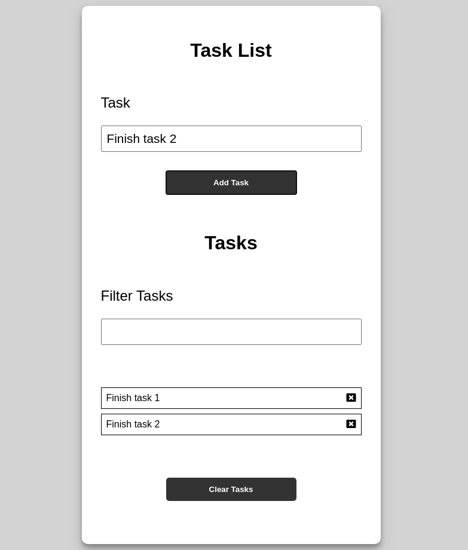

# Task-List
Simple task list app made using HTML, CSS and Javascript. Local storage has been used to save the data on the browser.

# Features

## 1. Adding a task 
A task can be added using by clicking the Add Task button.

## 2. Removing a task
An added task can be removed by clicking the cross button on the right.

## 3. Filtering tasks
Tasks can be filtered from the available list of added tasks by typing a word that belongs to the task.

## 4. Clearing all tasks
All tasks can be cleared using the Clear Tasks button.

# Screenshot

